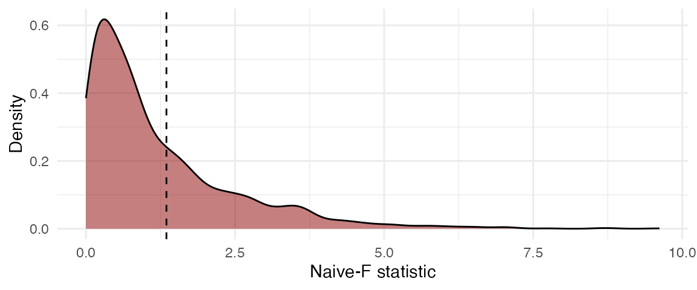

# Cluster Wild Bootstrapping for Meta-Analysis

## Dependence in Meta-Analysis

Typical methods to conduct meta-analysis or meta-regression work under
the assumption that the effect size estimates are independent. However,
primary studies often report multiple, statistically dependent estimates
of effect sizes. Dependent effect sizes can occur through correlated
effects structure, a hierarchical effects structure, or a combination of
the two (Hedges, Tipton, & Johnson, 2010; Pustejovsky & Tipton, 2021). A
correlated effects data structure typically occurs due to multiple
correlated measures of an outcome, repeated measures of the outcome
data, or comparison of multiple treatment groups to the same control
group (Hedges et al., 2010). A hierarchical effects structure typically
occurs when the meta-analysis includes multiple primary studies
conducted by the same researcher, by the same lab, or in the same region
(Hedges et al., 2010).

Researchers may be inclined to ignore dependence and use methods that
assume that each effect size estimate is independent. However, doing so
can result in inaccurate standard errors and, consequently, hypothesis
tests with incorrect Type I error rates and confidence intervals with
incorrect coverage levels (Becker, 2000). Ad-hoc methods for handling
dependence include averaging effect sizes by study or selecting a single
effect size per study. These methods result in loss of information and
are not suitable for studying within-study variation in effect sizes
(Hedges et al., 2010). A method called shifting the unit-of-analysis
involves running meta-analytic models for different subsets of the data
(Cooper, 1998). However, this strategy is not useful if a researcher
wants to summarize effects across the subsets or study differential
effects (Becker, 2000).

The ideal solution for handling dependence would be to use a
multivariate model (Becker, 2000; Hedges et al., 2010). This approach
explicitly models dependence among the effect sizes (Becker, 2000;
Hedges et al., 2010). However, multivariate meta-analysis requires
knowledge of correlations or covariances between pairs of effect size
estimates within each study, which are often difficult to obtain from
primary studies.

To handle dependence without knowing the covariance structure between
effect size estimates, Hedges et al. (2010) proposed the use of robust
variance estimation (RVE). RVE involves estimating the variances for the
meta-regression model’s coefficients using sandwich estimators that are
valid even when the covariance structure is unknown or mis-specified
(Hedges et al., 2010). However, the performance characteristics of RVE
are asymptotic in that a large number of clusters or studies is required
to provide accurate standard error estimates (Hedges et al., 2010). If
the number of studies in a meta-analysis is small, RVE, as originally
proposed by Hedges et al. (2010), can result in downwardly biased
standard errors and inflation of Type I error rates (Hedges et al.,
2010; Tipton, 2015).

Tipton (2015) and Tipton & Pustejovsky (2015) examined several small
sample correction methods to improve the performance of RVE. Tipton
(2015) recommended CR2 type correction for RVE as well as the use of
Satterthwaite degrees of freedom for single coefficient tests. Tipton &
Pustejovsky (2015) examined corrections for multiple-contrast hypothesis
tests. Tipton & Pustejovsky (2015) found that the HTZ test, which is an
extension of the CR2 correction method with the Satterthwaite degrees of
freedom, controlled Type 1 error rate adequately even when the number of
studies was small. However, Joshi, Pustejovsky, & Beretvas (2022)
showed, through simulations, that the HTZ test can be conservative. The
authors examined another method, cluster wild bootstrapping (CWB), that
has been studied in the econometrics literature but not in the
meta-analytic context. The results of the simulations from Joshi et al.
(2022) showed that CWB adequately controlled for Type 1 error rate and
provided higher power than the HTZ test, especially for
multiple-contrast hypothesis tests.

## Bootstrapping

General bootstrapping can be used to estimate measures of uncertainty,
like standard errors, p-values and confidence intervals, even when other
methods fail (Boos et al., 2003). Bootstrapping involves re-sampling
from the original data many times to create an empirical distribution
which is used in place of the distribution of an estimate or test
statistic (Boos et al., 2003).

Several bootstrapping data generating processes are available. The most
common one is pair bootstrapping, which involves re-sampling with
replacement the set of outcome and covariate data for each case
(Freedman, 1981, 1984). For data involving clusters, the entire cluster
is re-sampled (Cameron, Gelbach, & Miller, 2008). In meta-analytic
studies with small number of clusters, pairs bootstrapping can result in
lack of variance in the distribution of covariates rendering estimation
of coefficients infeasible (Cameron et al., 2008).

Another type of bootstrapping involves re-sampling residuals (Cameron et
al., 2008). In case with clusters, entire vector of residuals for each
cluster is re-sampled (Cameron et al., 2008; MacKinnon, 2009). Such a
procedure requires clusters to be of equal size and has an underlying
assumption that the errors are independently and identically distributed
(MacKinnon, 2009).

An ideal way to bootstrap when the number of clusters is small is to use
cluster wild bootstrapping, which involves sampling weights and
multiplying residuals with the random weights (Cameron et al., 2008;
MacKinnon, 2009). In contrast to the process of pair bootstrapping, the
process of CWB does not involve re-sampling the distribution of
predictor variables. Thus, the problem of lack of variance in covariates
due to re-sampling does not occur with CWB (Cameron et al., 2008;
MacKinnon, 2009). Further, in contrast to residual bootstrapping, CWB
does not require clusters to have the same size and does not require the
errors to be independently and identically distributed (Cameron et al.,
2008; MacKinnon, 2009).

### Cluster Wild Bootstrapping

This section provides an overview of the cluster wild bootstrapping
algorithm.

MacKinnon (2009) recommended imposing the null hypothesis when running
bootstrap hypothesis tests as the process of hypothesis testing involves
examining where the test statistic lies on the the sampling distribution
based on the null hypothesis. For weights to use in cluster wild
bootstrapping, MacKinnon (2015) and Webb (2013) have shown that the
Rademacher weights, which take on the values of -1 and 1 with the
probability of 0.5 each, outperform all other types of weights for
studies with number of clusters as low as 10.

The general process of conducting cluster wild bootstrapping is as
follows (Cameron et al., 2008; MacKinnon, 2009):

1.  Fit a null model and a full model on the original data.

2.  Obtain residuals from the null model.

3.  Generate an auxiliary random variable that has mean of 0 and
    variance of 1 and multiply the residuals by the random variable
    (e.g., Rademacher weights) set to be constant within clusters (CWB).
    The residuals can also be multiplied by CR2 adjustment matrices
    before multiplying by weights (CWB Adjusted). Adjusting the
    residuals by CR2 matrices can correct the under-estimation of the
    error variance when the working model is incorrect (Davidson &
    Flachaire, 2008; MacKinnon, 2006; Pustejovsky & Tipton, 2018).

4.  Obtain new outcome scores by adding the transformed residuals to the
    predicted values from the null model fit on the original data.

5.  Re-estimate the full model with the new calculated outcome scores
    and obtain the test statistic.

6.  Repeat steps 3-5 R times. Calculate p-value:

p = \frac{1}{R} \sum\_{r = 1}^R I\left(F^{(r)} \> F\right)

The results of the simulation studies conducted in Joshi et al. (2022)
did not show any difference in Type 1 error rates or power when
multiplying the results by CR2 adjustments matrices. However, the
authors did not study major mis-specifications of the working model in
the simulation studies.

## Example from `wildmeta`

This section presents examples of how to implement cluster wild
bootstrapping using functions from our `wildmeta` package. The functions
in our package work with models fit using
[`robumeta::robu()`](https://rdrr.io/pkg/robumeta/man/robu.html)
(Fisher, Tipton, & Zhipeng, 2017) and
[`metafor::rma.mv()`](https://wviechtb.github.io/metafor/reference/rma.mv.html)
(Viechtbauer, 2010).

### `robumeta` models

The examples in this vignette utilize the `SATCoaching` dataset from the
`clubSandwich` package (Pustejovsky, 2020), originally from DerSimonian
& Laird (1983). The standardized mean differences represent the effects
of SAT coaching on SAT verbal (SATV) and/or SAT math (SATM) scores.

The code below runs cluster wild bootstrapping to test the
multiple-contrast hypothesis that the effect of coaching does not differ
based on study type. The `study_type` variable indicates whether groups
compared in primary studies were matched, randomized, or non-equivalent.
The meta-regression model also controls for hours of coaching provided
(`hrs`) and whether the students took math or verbal test (`test`).
Below, we run a zero-intercept meta-regression model.

The
[`Wald_test_cwb()`](https://meghapsimatrix.github.io/wildmeta/reference/Wald_test_cwb.md)
function takes in a full model fit using the
[`robumeta::robu()`](https://rdrr.io/pkg/robumeta/man/robu.html)
function. Further, users need to specify the constraint to be tested.
Below, we create a constraint matrix using
[`clubSandwich::constrain_equal()`](http://jepusto.github.io/clubSandwich/reference/constraint_matrices.md);
indices 1 to 3 correspond to the three levels of the `study_type`
variable. Users can specify the number of bootstrap replications R. In
the examples below, we set the value to 99 to speed up computation time.
In practice, we recommend using a higher number of bootstrap
replications, such as 1999. Using more replications will improve power.
Please see Davidson & MacKinnon (2000) for guidance on the number of
bootstrap replications to use. Users can also set the seed in the
[`Wald_test_cwb()`](https://meghapsimatrix.github.io/wildmeta/reference/Wald_test_cwb.md)
function.

``` r

library(wildmeta)
library(clubSandwich)
library(robumeta)

robu_model <- robu(d ~ 0 + study_type + hrs + test,
                   studynum = study,
                   var.eff.size = V,
                   small = FALSE,
                   data = SATcoaching)

Wald_test_cwb(full_model = robu_model,
              constraints = constrain_equal(1:3),
              R = 99,
              seed = 20201228)
#>   Test Adjustment CR_type Statistic  R     p_val
#> 1  CWB        CR0     CR0   Naive-F 99 0.3131313
```

The output of the function contains the name of the test, the adjustment
used for the bootstrap process, the type of variance-covariance matrix
used, the type of test statistic, the number of bootstrap replicates,
and the bootstrapped p-value.

The users can also specify whether to adjust the residuals with `CR1` to
`CR4`matrices when bootstrapping as below. The default value for the
`adjust` argument is set to `CR0`. Below is an example where we set the
adjust the residuals using `CR2` matrices.

``` r

Wald_test_cwb(full_model = robu_model,
              constraints = constrain_equal(1:3),
              R = 99,
              adjust = "CR2",
              seed = 20201229)
#>           Test Adjustment CR_type Statistic  R     p_val
#> 1 CWB Adjusted        CR2     CR0   Naive-F 99 0.4242424
```

### `metafor` models

In the examples above, we used the
[`robumeta::robu()`](https://rdrr.io/pkg/robumeta/man/robu.html)
function to fit the full model. In this section, we fit the full model
using the
[`metafor::rma.mv()`](https://wviechtb.github.io/metafor/reference/rma.mv.html)
function. (We use a small, entirely insufficient number of replications
in order to limit the computing time of this vignette.)

``` r

library(metafor)

rma_model <- rma.mv(yi = d ~ 0 + study_type + hrs + test,
                    V = V,
                    random = ~ study_type | study,
                    data = SATcoaching,
                    subset = !is.na(hrs) & !is.na(test))

Wald_test_cwb(full_model = rma_model,
              constraints = constrain_equal(1:3),
              R = 19,
              seed = 20210314)
#>   Test Adjustment CR_type Statistic  R     p_val
#> 1  CWB        CR0     CR0   Naive-F 19 0.2105263
```

### Timing

#### `robumeta` models

The
[`Wald_test_cwb()`](https://meghapsimatrix.github.io/wildmeta/reference/Wald_test_cwb.md)
function runs within a minute for correlated effects models even when
using a large number of bootstrap replications. Below is an example with
1999 bootstrap replications.

``` r

system.time(
  res <- Wald_test_cwb(full_model = robu_model,
                       constraints = constrain_equal(1:3),
                       R = 1999, 
                       seed = 20201229)
)
#>    user  system elapsed 
#>   3.366   0.016   3.384
```

Computation speed can sometimes be improved by setting a parallel
processing plan using the `future` package:

``` r

library(future)

if (parallelly::supportsMulticore()) {
  plan(multicore) 
} else {
  plan(multisession)
}

nbrOfWorkers()
#> [1] 10

system.time(
  res <- Wald_test_cwb(full_model = robu_model,
                       constraints = constrain_equal(1:3),
                       R = 1999, 
                       seed = 20201229)
)
#>    user  system elapsed 
#>   5.774   0.878   0.983

plan(sequential)
```

#### `metafor` models

CWB takes longer with models fit using
[`metafor::rma.mv()`](https://wviechtb.github.io/metafor/reference/rma.mv.html).
Below is an example with 99 bootstrap replications:

``` r

reps
#> [1] 99

system.time(
  res_seq <- Wald_test_cwb(full_model = rma_model,
                           constraints = constrain_equal(1:3),
                           R = reps,
                           seed = 20210314)
)
#>    user  system elapsed 
#>   4.920   0.029   4.954

res_seq
#>   Test Adjustment CR_type Statistic  R     p_val
#> 1  CWB        CR0     CR0   Naive-F 99 0.2525253
```

Again, computation speed can sometimes be improved by setting a parallel
processing plan using the `future` package:

``` r

library(future)

if (parallelly::supportsMulticore()) {
  plan(multicore) 
} else {
  plan(multisession)
}

nbrOfWorkers()
#> [1] 10

system.time(
  res_para <- Wald_test_cwb(full_model = rma_model,
                            constraints = constrain_equal(1:3),
                            R = reps,
                            seed = 20210314)
)
#>    user  system elapsed 
#>   7.915   0.709   1.176

plan(sequential)

res_para
#>   Test Adjustment CR_type Statistic  R     p_val
#> 1  CWB        CR0     CR0   Naive-F 99 0.2525253
```

## Bootstrap Distribution Plot

The function
[`plot()`](https://meghapsimatrix.github.io/wildmeta/reference/plot.Wald_test_wildmeta.html)
creates a `ggplot` figure representing the distribution of the bootstrap
replicates based on the results from the
[`Wald_test_cwb()`](https://meghapsimatrix.github.io/wildmeta/reference/Wald_test_cwb.md)
function. The dashed line represents the F test statistic from the
original full model. The bootstrapped p-value is the proportion of
bootstrapped F test statistics that are greater than the original F
statistic.

``` r

plot(res, fill = "darkred", alpha = 0.5)
```



## References

Becker, B. J. (2000). Multivariate meta-analysis. In *Handbook of
applied multivariate statistics and mathematical modeling* (pp.
499–525). Elsevier.

Boos, D. D. et al. (2003). Introduction to the bootstrap world.
*Statistical Science*, *18*(2), 168–174.

Cameron, A. C., Gelbach, J. B., & Miller, D. L. (2008). Bootstrap-based
improvements for inference with clustered errors. *The Review of
Economics and Statistics*, 47.

Cooper, H. M. (1998). *Synthesizing research: A guide for literature
reviews* (Vol. 2). Sage.

Davidson, R., & Flachaire, E. (2008). The wild bootstrap, tamed at last.
*Journal of Econometrics*, *146*(1), 162–169.

Davidson, R., & MacKinnon, J. G. (2000). Bootstrap tests: How many
bootstraps? *Econometric Reviews*, *19*(1), 55–68.

DerSimonian, R., & Laird, N. (1983). Evaluating the effect of coaching
on SAT scores: A meta-analysis. *Harvard Educational Review*, *53*(1),
1–15.

Fisher, Z., Tipton, E., & Zhipeng, H. (2017). *Robumeta: Robust variance
meta-regression*. Retrieved from
<https://CRAN.R-project.org/package=robumeta>

Freedman, D. A. (1981). Bootstrapping regression models. *The Annals of
Statistics*, *9*(6), 1218–1228.

Freedman, D. A. (1984). On bootstrapping two-stage least-squares
estimates in stationary linear models. *The Annals of Statistics*,
*12*(3), 827–842.

Hedges, L. V., Tipton, E., & Johnson, M. C. (2010). Robust variance
estimation in meta-regression with dependent effect size estimates.
*Research Synthesis Methods*, *1*(1), 39–65.
<https://doi.org/10.1002/jrsm.5>

Joshi, M., Pustejovsky, J. E., & Beretvas, S. N. (2022). Cluster wild
bootstrapping to handle dependent effect sizes in meta-analysis with a
small number of studies. *Research Synthesis Methods*.
<https://doi.org/10.1002/jrsm.1554>

MacKinnon, J. G. (2006). Bootstrap methods in econometrics. *Economic
Record*, *82*, S2–S18.

MacKinnon, J. G. (2009). Bootstrap hypothesis testing. *Handbook of
Computational Econometrics*, *183*, 213.

MacKinnon, J. G. (2015). Wild cluster bootstrap confidence intervals.
*L’Actualité Économique*, *91*(1-2), 11–33.

Pustejovsky, J. E. (2020). *clubSandwich: Cluster-robust (sandwich)
variance estimators with small-sample corrections*. Retrieved from
<https://CRAN.R-project.org/package=clubSandwich>

Pustejovsky, J. E., & Tipton, E. (2018). Small-sample methods for
cluster-robust variance estimation and hypothesis testing in fixed
effects models. *Journal of Business & Economic Statistics*, *36*(4),
672–683.

Pustejovsky, J. E., & Tipton, E. (2021). Meta-analysis with robust
variance estimation: Expanding the range of working models. *Prevention
Science*.

Tipton, E. (2015). Small sample adjustments for robust variance
estimation with meta-regression. *Psychological Methods*, *20*(3), 375.

Tipton, E., & Pustejovsky, J. E. (2015). Small-sample adjustments for
tests of moderators and model fit using robust variance estimation in
meta-regression. *Journal of Educational and Behavioral Statistics*,
*40*(6), 604–634.

Viechtbauer, W. (2010). Conducting meta-analyses in R with the metafor
package. *Journal of Statistical Software*, *36*(3), 1–48.

Webb, M. D. (2013). *Reworking wild bootstrap based inference for
clustered errors*. Queen’s Economics Department Working Paper.
